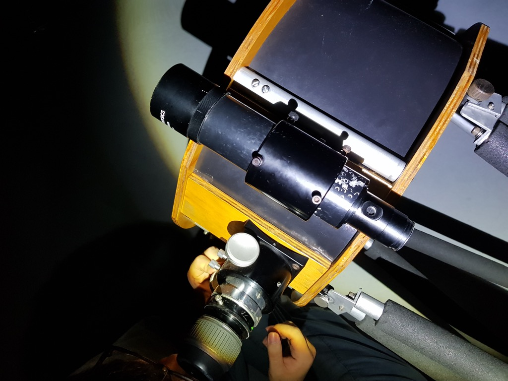

## 14.5인치

### 구성품 확인

1. 주경부
 * 주경커버에 부착된 밀폐용기에 레이저 콜리메이터와 육각렌치 두 개가 들어 있다.
1. 사경부
1. 적당한 아이피스 (주로 Pentax XW 14mm를 사용)
1. 트러스

---

### 14.5인치 설치

* 주경을 적당한 장소에 놓고 네 방향에 각각 트러스를 끼운다.

* 트러스의 아랫부분과 윗부분이 각각 사진과 같은 방향이 되도록 설치한다. 나사를 너무 단단히 조이면 사경을 올리기 어려우므로 다소 헐겁게 조인다.

* 사경부분을 올린다. 사진과 같이 트러스의 윗부분이 사경의 부품 사이로 들어오도록 한다.
* 이 때 관측자가 망원경의 왼쪽에 서서 관측할 수 있도록 아이피스가 왼쪽에 오는 방향으로 올린다.
* 이후 사경 트러스 고정 나사를 조여 사경을 고정하고, 주경부위 트러스 고정 나사를 마저 조인다. 두 명이 있으면 좋다.

* 설치가 완료된 모습.
* 이제 주경 커버를 벗겨도 된다.
 * **절대 이 단계 이전에 주경 커버를 분리하지 않는다. 해체할 때도 항상 주경 커버를 제일 먼저 덮고 작업한다.**

* 레이저 콜리메이터를 접안부에 끼우고 측면의 나사를 돌려 고정시킨다.

* 매우 위험해 보인다.

* 주경 커버에 붙어 있는 밀폐용기에 들어있는 작은 렌치를 이용, 사경부분의 육각렌치를 돌려 사경에 반사된 레이저가 주경의 센터마킹 안에 들어오도록 한다.

* 레이저가 주경의 센터마킹 내부로 들어온 모습

* 주경 아랫면을 덮는 부직포를 분리하면 주경의 광축을 조절할 수 있다.
* 밀폐용기에 들어 있던 보다 큰 렌치를 이용해, 주경 아래의 육각렌치를 조절한다. 주경을 조절하여 주경에 반사된 빛과 처음 사경에 입사한 빛이 일치하도록 한다.

* 광축을 맞춘 뒤에는 레이저 콜리메이터를 빼고 아이피스를 끼운다.
 * 14.5인치의 클레이포드 방식 포커서는 두 가지의 나사가 있으며, 하나는 클레이포드 포커서를 밀착시키는 나사이고, 하나는 포커서를 고정하는 나사이다.

* 파인더를 정렬한 뒤 관측한다.

---

### 14.5인치 취급 주의사항

* 미러 커버는 항상 사경까지 설치한 뒤 벗기고, 해체할 때 제일 먼저 씌운다.
