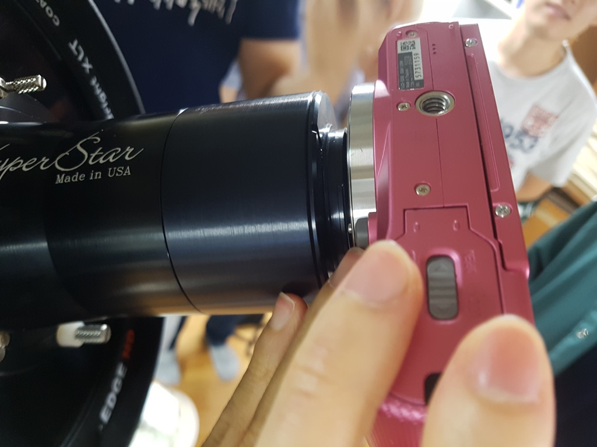

## C9.25 및 NEQ6 설치 매뉴얼

### 구성품 확인

1. C9.25가 들어 있는 거대하고 무거운 플라스틱 케이스
1. 삼각대가 들어 있는 가방
1. 하이퍼스타가 들어 있는 가방
1. NEQ6가 들어 있는 끔찍하게 무거운 알루미늄 케이스
1. 무게추가 들어 있는 무거운 가방
1. 파워뱅크 (12V 30Ah) 또는 작고 무거운 납축전지

---

### NEQ6 설치

* 기본적으로 C9.25는 NEQ6 위에 설치한다. 그런데 NEQ6와 EM-200의 적위 헤드(망원경 접속부)는 동일하므로 NEQ6에 FS-102를 결합하거나, EM-200에 C9.25를 결합할 수 있다. 하지만 동아리의 EM-200은 노후화가 심한 상태이므로 가급적 C9.25를 올리지 않는 것이 좋다. 물론 본인이 책임질 수 있다면 올려도 된다.

* 평평한 곳에 수평을 맞춰 NEQ6용 스테인리스 삼각대를 설치한다. 이 때 금속 막대가 튀어나온 부분(alignment peg)이 북쪽으로 향하도록 한다.

 *  NEQ6와 EM-200은 삼각대 및 체결 나사 규격이 다르다. 삼각대를 바꿔 사용할 경우 설치가 되지 않거나 해체가 되지 않을 수 있으니 절대로 삼각대를 바꿔서 사용하면 안 된다.
 * NEQ6와 EM-200의 체결 나사는 비슷해 보이지만 각각 12mm, 1/2인치로 다른 나사이다.

 

* 삼각대 하단 끝부분의 나사를 풀고, 아이피스 플레이트를 끼운 뒤 나사를 조인다. 이 때 나사를 끝까지 조이지 않는다. 아이피스 플레이트는 설치하지 않아도 무방하다.

* 금속 막대에 주의하며 NEQ6를 삼각대에 올린다.
 * **NEQ6를 올리는 중에 적경 및 적위축이 갑자기 회전하지 않도록 클램프를 조여 고정한 뒤 올린다.**
 * NEQ6가 심각대에 잘 올라가지 않는다면 alignment peg 양 옆에 있는 검은색 방위각 조절 나사를 조금 풀어 본다.

* 삼각대 중앙의 나사를 끝까지 조여 NEQ6를 단단히 고정시킨다. 아이피스 플레이트를 설치했을 경우 플레이트 아래의 나사도 단단히 조인다.

* 무게추봉을 고정하는 클램프를 풀어 무게추봉을 꺼낸다.

* 무게추봉을 고정하는 클램프를 조여 무게추봉을 고정시킨다. 이후 무게추봉 끝부분의 스토퍼 나사를 분리한다.

* 무게추를 끼우고 나사를 조여 고정시킨다. 이 때 무게추는 나사가 위로 가도록 끼워야 한다. 무게추를 끼운 뒤에는 무게추봉 끝부분의 스토퍼 나사를 단단히 조인다.
 * 반드시 무게추봉이 아래로 향한 상태에서 작업한다. 무게추봉이 옆으로 향한 상태에서 무게추를 끼울 경우 클러치가 미끄러져 갑자기 회전할 수 있다.
 * 무게추 두 개를 모두 끝까지 빼면 대략적으로 균형이 맞는다.

* Synscan 핸드 컨트롤러를 적도의 본체의 뭔가 핸드 컨트롤러를 연결하면 될 것만 같은 단자에 연결한다. 

* 전원 케이블은 시가잭 케이블(길이 60cm)과 연장선의 두 부분으로 구성되어 있다. 전원 케이블을 찾아 적도의의 전원 포트에 연결한다.

* 파워뱅크에 시가잭 전원을 연결하고 전원을 켠다.
 * 파워뱅크의 전원스위치와 LCD는 상당히 밝다. 적당한 도구나 물체 등으로 잘 가리는 것이 좋다.
 * NEQ6는 DC 포트가 일반적인 케이블과 동일한 방향(중심 +, 주변 -)으로 되어 있다. 혹시 납축전지에 집게로 연결할 경우 같은 색끼리 연결한다.

* NEQ6의 전원을 켜면 극축 망원경에 붉은 배경 조명이 켜질 것이다. 경통과 각종 장비를 모두 올린 뒤, 이 상태로 극축 망원경을 보며 극축을 정렬한다. 이 때 적위축을 약간 틀어 적위축에 뚫린 구멍이 극축 망원경과 평행이 되도록 해야 한다.
 * 장비를 올리면 극축이 틀어지므로 극축은 장비를 모두 올린 뒤 맞춰야 한다.
 * NEQ6의 극축 조절은 방위각 조절 나사 두 개와 고도 조절 나사 두 개로 이루어진다. 각각 양 쪽의 나사가 밀고 당기는 형식으로 되어 있으므로 한 쪽의 나사를 풀면서 반대쪽 나사를 조이면 된다.
 * NEQ6의 극축망원경 접안부 아래에 위치한 고도를 올리는 나사는 엄청나게 조이기 어렵다. 이것은 NEQ6 설계상의 결함으로 인한 고질적인 문제로, NEQ6 최대의 단점 중 하나이다. 이것 하나 때문에 NEQ6를 대규모로 개조하거나 아예 다른 적도의로 기변하는 사용자도 있다. 알아서 잘 조여 본다.
 * 장비와 무게추를 다른 사람이 들어 주면 고도를 올리는 나사를 조이기가 아주 약간 쉬워진다.

---

### C9.25 설치

* 도브테일 홀더를 두 개의 M8 렌치로 고정시킨다. M8 렌치볼트는 NEQ6 적위 헤드 부분에 끼워져 있을 것이다. 육각렌치는 6mm 사이즈를 사용한다.
 * 본인이 나중에 책임질 수 있는 만큼만 조인다. 너무 강하게 조이면 적위 헤드의 알루미늄이 손상될 수 있다.

* 적위축을 고정하는 클램프를 풀어 도브테일 홀더가 수평으로 오게 한다. 고정 나사가 위로 향하도록 해야 한다. 고정 나사를 적당히 풀어 경통이 들어갈 수 있도록 한다.
 * **고정 나사가 옆으로 향한 상태에서 경통을 올리면 위험하다.**
 * 고정 나사를 너무 풀면 나사가 빠져버릴 수 있다. 이 경우 와셔와 스프링을 분실하기 매우 쉬우므로 주의한다.

* C9.25를 조심스레 올리고 도브테일 홀더의 나사를 끝까지 잠가 고정시킨다.
 * **경우에 따라 나사가 잘 안 돌아가 고정된 것처럼 느껴지더라도 실제로는 끝까지 잠기지 않은 경우가 있다. 이 경우 경통을 세웠을 때 낙하할 수 있으니 반드시 잘 확인해야 한다.**
 * C9.25에 아이피스를 물려 사용할 경우 경통을 한계까지 앞으로 밀어도 균형이 맞지 않는다. 안시용으로 사용할 경우 큰 문제는 없으므로 그냥 사용해도 무방하다.

* 파인더를 장착한다.
 * 종종 파인더가 제대로 장착된 듯해 보여도 끝까지 들어가지 않은 경우가 있다. 파인더가 끝까지 들어가지 않으면 정렬이 불가능하므로 끝까지 장착한다.

---

### C9.25에 아이피스 사용하기

* 천정미러와 아이피스를 확인한다.
 * 천정미러는 천정미러가 들어 있을 것만 같이 생긴 골판지 상자에 들어 있다.
 * C9.25에 자주 사용하는 Luminos 23mm 아이피스는 왠지 아이피스가 들어 있을 것만 같이 생긴 박스에 들어 있다.

* 천정미러를 아이피스 장착부에 장착한다.
 * 너무 단단히 조이면 나중에 분리하기가 어려우므로 본인이 책임질 수 있는 만큼 조인다.

* 기본적으로 천정미러에는 1.25인치 아이피스 어댑터가 끼워져 있어 동아리 내 대부분의 아이피스를 그대로 사용할 수 있다. 한편 일반적으로 C9.25에는 2인치 아이피스인 Luminos 23mm를 사용한다. 이를 장착하려면 1.25인치 어댑터를 먼저 분리한다.

* 아이피스를 끼우고 옆면 나사를 조여 고정한다. 이후 적당히 초점을 맞춘다.

* C9.25의 경통 뒷면에는 3개의 나사 또는 노브가 있으며, 원뿔 모양 나사 2개와 원기둥 모양 나사 1개가 있다. 이 중 원뿔 모양 나사는 초점 고정 나사이며, 원기둥 모양 나사가 초점 조절 노브이다.
 * **초점을 조절할 때는 반드시 초점 고정 나사를 먼저 풀고 조절한다. 초점 고정 나사를 풀지 않고 초점을 조절하면 주경 고정 부위가 손상될 수도 있다.**
 * 본인이 뒷감당을 할 수 있다면 물론 초점 고정 나사를 풀지 않고 초점을 조절해도 무방하다. 감사드립니다.

* 설치가 완료된 모습

---

### Synscan 컨트롤러 사용하기

* 컨트롤러가 켜지면 위와 같은 화면이 나타날 것이다. ENTER 키를 누른다.

* 현재 관측소의 좌표를 입력한다. 스마트폰의 GPS 정보 앱으로 쉽게 현재 위치를 확인할 수 있다.

* 시간대와 현재 날짜 및 시간을 입력한다.
* 북한으로 소관을 가지 않는 이상 시간대를 바꿀 일은 없을 것이다.
* 천체는 상당히 빠르게 움직이기 때문에 시간은 가급적 초 단위까지 정확히 입력해 주는 것이 좋다.

* Begin Alignment라며 Align을 시작할지 묻는다. 필요에 따라 Align을 진행한다.
 * Alignment를 진행할 경우, 처음 시작 위치는 앞의 '설치가 완료된 모습'과 같이, 경통이 위, 무게추가 아래에 놓이고 경통이 북쪽을 향한 상태여야 한다. **다른 위치에서 align을 시작하면 align이 제대로 이루어지지 않거나 경통이 상각대, 적도의 등에 충돌할 수 있다.**

---

### Hyperstar 사용하기

* 부경 테두리의 고정 링을 돌려서 풀어낸다.
 * **경통이 수평 또는 땅을 향한 상태에서 부경 고정 링을 풀면 부경을 떨어뜨릴 수 있다. 본인의 키가 작더라도 반드시 경통을 위로 향한 상태에서 부경 고정 링을 분리한다.**
 * 나중에 부경을 다시 끼울 때에는, 부경의 홈과 부경 고정 부위의 튀어나온 돌기를 맞추어 조립한다.

* 하이퍼스타 앞쪽의 보호 캡을 돌려서 풀어낸다.
 * 돌려서 빠지는 부분 앞에 그냥 뺄 수 있는 캡이 있는데 그게 아니다.
 * 여기에 부경과 부경 고정 링을 끼워서 안전하게 보관할 수 있다.

* 부경을 분리한 부분에 하이퍼스타를 돌려 끼운다.
 * 하이퍼스타에 붙어 있는 6개의 나사는 광축 조절 나사이다. 광축을 맞추고자 하는 것이 아니면 가급적 건드리지 않는다.
 * 근데 언젠가 보니 광축 조절 나사가 풀려 있더라. 아마 안 맞을 것이다. ㅅㄱㅇ

* 하이퍼스타 뒷면의 캡을 분리한다.
 * 이건 돌려 빼는 게 아니라 당겨 빼는 캡이다.

* 카메라를 장착한다. 캐논 카메라를 장착해야 한다면 원래 장착되어 있는 소니 어댑터를 분리하고 캐논 어댑터를 연결한다.

---

### NEQ6 해체 시 주의사항

* M8 렌치는 다시 NEQ6의 적위 헤드에 끼워 놓는다.
* 케이스에 넣을 때에는 적위 헤드를 아래로 향하도록 한다.
* 케이블과 다른 구성품을 케이스에 넣기 전 NEQ6 본체를 먼저 넣는다.
* 적도의를 보관할 때에는 항상 적경과 적위축을 고정하는 클램프를 풀어 놓는다. 클램프를 잠근 채 보관하면 웜 기어가 손상될 우려가 있다.