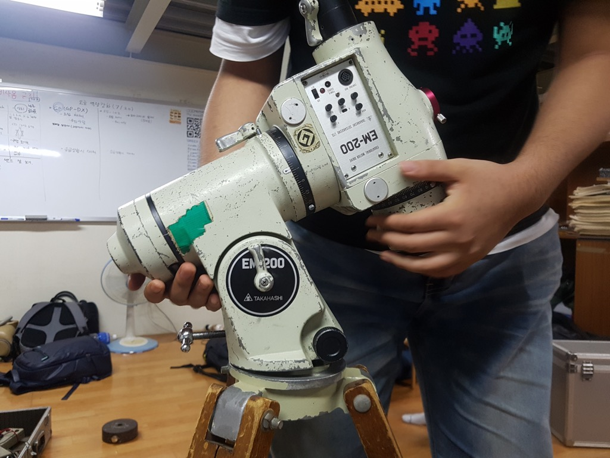
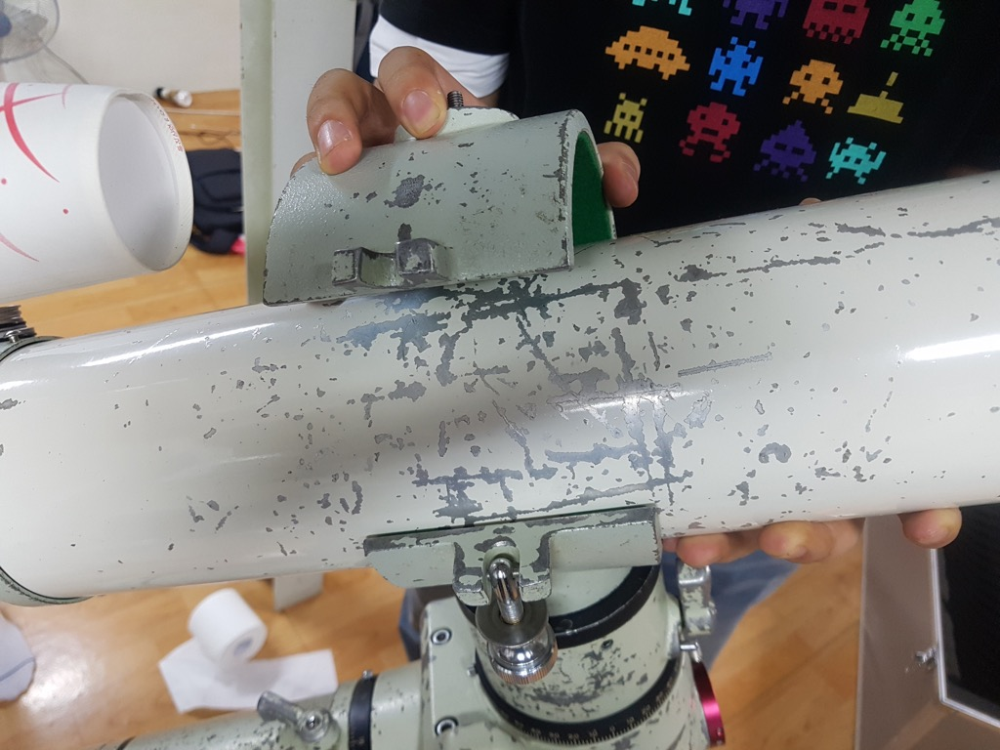

## EM-200 및 FS-102 설치 매뉴얼

### 구성품 확인 

1. 다카하시 나무 삼각대l
1. EM-200이 들어 있는 끔찍하게 무거운 알루미늄 케이스
1. 무게추 및 각종 전선이 들어 있는 무거운 알루미늄 케이스
1. FS-102가 들어 있는 알루미늄 케이스
1. 작고 무거운 납축전지

---

### EM-200 설치

* 나무삼각대를 약간 펴고 삼각 플레이트를 볼트로 고정시킨다. 볼트는 아래에서 위로 삽입한다. 삼각대 위의 튀어나온 금속 막대(alignment peg)가 북쪽을 향하도록 한다.
 *  NEQ6와 EM-200은 삼각대 및 체결 나사 규격이 다르다. 삼각대를 바꿔 사용할 경우 설치가 되지 않거나 해체가 되지 않을 수 있으니 절대로 삼각대를 바꿔서 사용하면 안 된다.
 * NEQ6와 EM-200의 체결 나사는 비슷해 보이지만 각각 12mm, 1/2인치로 다른 나사이다.

* EM-200을 삼각대 위에 올린다. 이 때 튀어나온 금속 막대(alignment peg)의 방향에 유의한다.
 * **EM-200을 올리는 중에 적경 및 적위축이 갑자기 회전하지 않도록 클램프를 조여 고정한 뒤 올린다.**
 * EM-200이 심각대에 잘 올라가지 않는다면 alignment peg 양 옆에 있는 검은색 방위각 조절 나사를 조금 풀어 본다.

* 하단의 나사를 조여 EM-200을 삼각대에 단단히 고정한다.

* 무게추봉 고정 클램프를 풀어 무게추봉을 꺼낸다.

* 무게추봉 끝부분의 스토퍼 나사를 풀고 무게추를 끼운다.
 * 반드시 무게추봉이 아래로 향한 상태에서 작업한다. 무게추봉이 옆으로 향한 상태에서 무게추를 끼울 경우 클러치가 미끄러져 갑자기 회전할 수 있다.

* 여러분의 발등을 보호할 스토퍼 나사를 다시 끼운다.

* FS-102 박스에서 경통밴드와 렌치볼트 두 개가 들어 있는 통을 꺼낸다.

* 육각렌치는 6mm 렌치를 사용한다.

* 나사구멍을 맞추어 경통밴드를 올린 뒤 볼트를 끼워 단단히 고정한다.
 * 볼트를 너무 세게 조이면 알루미늄이 손상될 수 있으므로 적당히 조인다.

* 경통을 경통밴드에 끼운다. 경통 외부의 세월의 흔적을 보면 대략적으로 어느 위치에 끼워야 하는 지 알 수 있을 것이다.

* 경통밴드 나사를 조인다. 이 때 와셔가 사진과 같은 위치로 가도록 한다.
 * 나사를 너무 풀면 빠져버릴 수 있으므로 주의한다.

* 카메라나 아이피스 등 필요한 액세서리를 전부 끼우고 균형을 잡는다. 적경축과 적위축 각각 균형을 잡아 준다.

* 전선들이 들어 있는 박스에서 컨트롤러를 꺼낸다.
 * 박스 안에는 EM-10B용과 EM-200용의 컨트롤러 두 가지가 있는데 어느 쪽을 사용해도 무방하다.

* 왠지 컨트롤러를 연결해야만 할 것 같이 생긴 단자에 컨트롤러를 연결한다.

* 왠지 전원을 연결해야만 할 것 같은 단자에 전원을 연결한다.
 * **EM-200은 전원 단자의 안쪽이 -, 바깥쪽이 +로 다른 모든 장비와 극성이 다르다. 때문에 납축전지에 극성을 바꾸어(빨간색을 검은색에, 검은색을 빨강색에) 연결하여야 하며, 절대 파워뱅크를 쓰면 안 된다.**

* 시거잭 어댑터를 통해 DC 전원선을 연결하고, 납축전지에 악어클립을 **극성을 바꾸어** 연결한다.

* 설치 완료. 극축을 맞추고 관측을 진행한다.

---

### EM-200 해체할 때 참고사항

* 무게추봉을 넣을 때는 무게추를 쓰면 쉽다.

* FS-102와 EM-200 케이스 내부는 사진과 같이 정리한다.
* 적도의를 보관할 때에는 항상 적경과 적위축을 고정하는 클램프를 풀어 놓는다. 클램프를 잠근 채 보관하면 웜 기어가 손상될 우려가 있다.