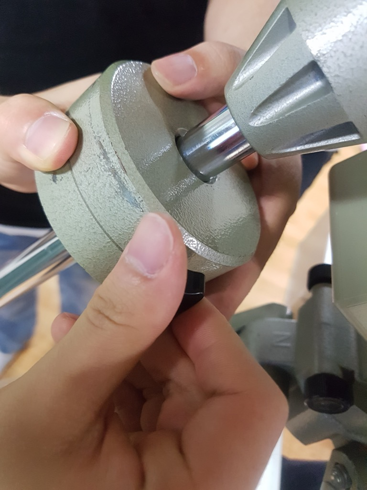
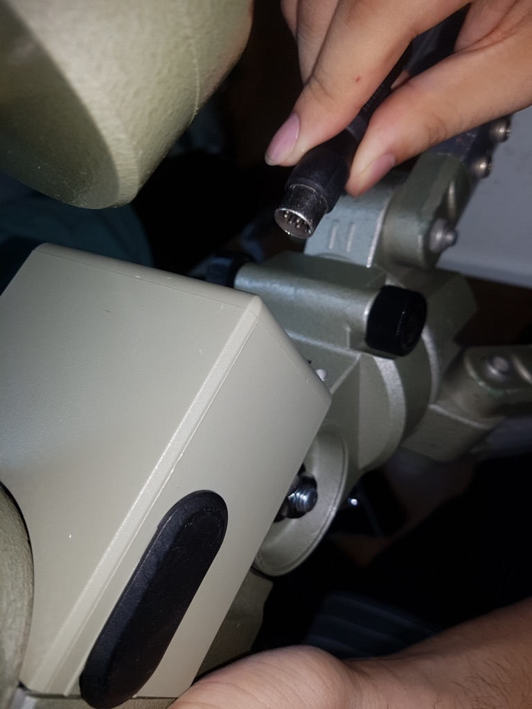
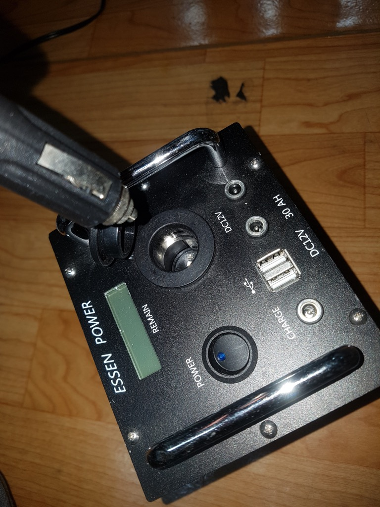

## GP/GP-DX 설치 매뉴얼

### 구성품 확인

1. 삼각대
1. 파워뱅크 (12V 30Ah) 또는 작고 무거운 납축전지
1. GP 보관용 캐리어

---

### GP 설치

* 가방을 열어 주요 구성품들이 잘 있는지 확인한다.
 * GP
 * 1.9kg 무게추
 * 삼각대 플레이트
 * 무게추봉
 * 컨트롤러 및 전선류
 * 볼헤드 및 도브테일 바
* 없는 구성품이 있다면 장비 사용 대장을 확인하여 직전에 GP를 사용한 사람을 추궁한다.

 * **3.7kg 무게추는 가방과 별도로 돔에 보관되어 있으며, LX-50을 설치할 때는 반드시 3.7kg 무게추가 있어야 한다. 소관에 LX-50을 가져갈 때는 3.7kg 무게추를 잊지 않도록 한다.**

* 삼각대를 펼친다. 사진과 같이 2단까지 펼쳐도 되나, 진동이 심해지기 때문에 2단은 펼치지 않는 것이 좋다.

* 삼각형 플레이트를 삼각대에 사진과 같이 연결한다.
 * 나사는 2개밖에 없다.

* GP를 삼각대에 올린다. 한쪽에 튀어나온 금속 막대(alignment peg)가 북쪽으로 가도록 한다.
 * GP가 심각대에 끼워지지 않는다면 alignment peg 양 옆에 있는 검은색 방위각 조절 나사를 조금 풀어 본다.

* 삼각대 아래의 나사를 단단히 조여 GP를 삼각대에 고정시킨다.

* 무게추봉을 무게추봉 결합 자리에 돌려서 끼운 뒤, 무게추봉 지지 나사를 끝까지 돌려 무게추봉이 제 자리에 고정되도록 한다.

* 무게추봉 끝의 스토퍼 나사를 빼내고 무게추를 끼운다. 이 때 무게추 고정 나사가 위쪽으로 가도록 한다.

* 무게추봉에 스토퍼 나사를 다시 끼운다.

* 도브테일을 도브테일 홀더에 연결하고 나사를 조여 고정시킨다. 이 때 큰 나사만 사용하고 작은 나사는 사용하지 않아도 무방하다.

* 볼 헤드를 이용해 카메라를 적도의에 연결한다.

* 적경축 무게 균형을 맞춰 준다.

* 적경축 모터 전원 케이블을 연결한다. 연결 단자는 모터박스의 아랫면 쪽에 위치한다.

* 모터 컨트롤러에 DC 전원 잭을 연결한다.
 * DC 전원 잭은 일반적인 전원 잭의 방향과 같은 중앙 핀 +, 주변 -로 정방향이다. 납축전지에 연결할 때에는 색을 맞춰 정방향으로 연결해야 한다.

* DC 전원 잭을 파워뱅크나 납축전지에 연결한다.

* 모터 컨트롤러의 전원 스위치를 켠다. 회전 방향이 북반구로 설정되어 있는지 확인한다.

* 방위각 조절 나사와 고도 조절 나사를 적절히 돌려 극축을 맞춘다.
